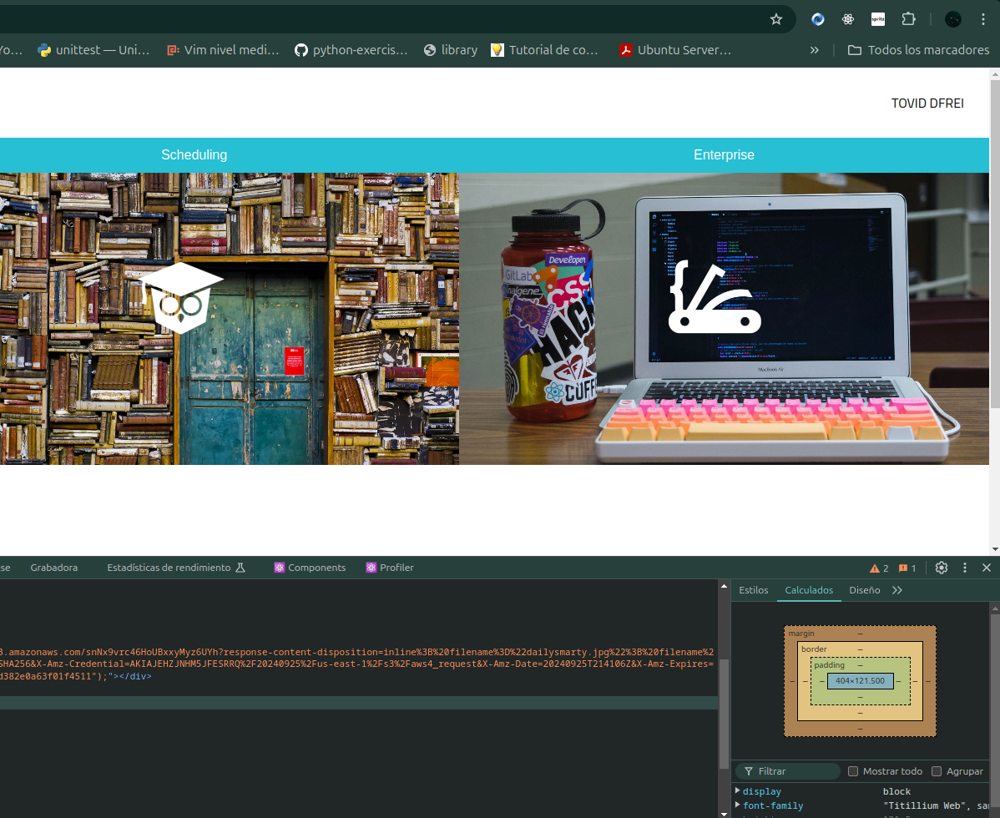

# ¿Por qué es útil React Devtools?

Lo primero que creo que debería hacer es ponerme en contexto, hasta la fecha, hemos estado utilizando la consola para depurar, para ver lo que nos devuelve un script, un método, en definitiva para ver lo que nuestro código nos ofrece, bueno, pues al trabajar con React y teniendo presente y fundamentalmente grabado a fuego en la mente que React está basado en componentes. La Devtools de React es una herramienta que nos permite entrar dentro del componente, verlo por dentro, ver su estado, ver sus matrices, en definitiva radiografiarlo, creo que útil se quedaría corto, es necesario saber que contiene un componente, que debemos depurar dentro de él, por ejemplo un uso básico sería ver el árbol completo de nuestra aplicación y es algo que Devtools nos ofrece, nos proporciona la estructura completa de nuestra aplicación y nos facilita el acceso a cualquier parte de ella.

Bueno, si me permitís hacer una comparativa es como cuando llevamos el coche al taller y viene un mecánico con una cajita y un cable y la conecta a nuestro coche, considera el coche tu React, pues Devtools React es esa cajita, se conecta a tu coche y te cuenta todo lo que tiene dentro.

React Devtools es una extensión del navegador, por lo tanto, tienes que instalarlo en el navegador y una característica que tiene es que te dice que páginas estas realizadas con React, ofreciéndote ya una información importante de lo que estás viendo y de como se comporta la página donde estás, creo importante por lo menos integrar una imagen de donde podemos encontrar esta herramienta una vez instalada. Es sencillo hasta la fecha cuando nos decían abrimos la consola, había varios formas de hacerlos desde botón derecho sobre la página e inspeccionar o por el menú de herramientas, la forma en la que lleguemos a la consola es indiferente, nos tenemos que fijar en las pestañas, tendremos elementos, consola, etc. Y al final a la derecha nos aparecen una nueva pestaña "componentes".

